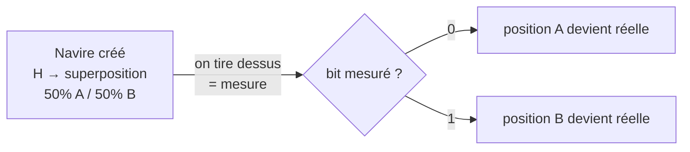
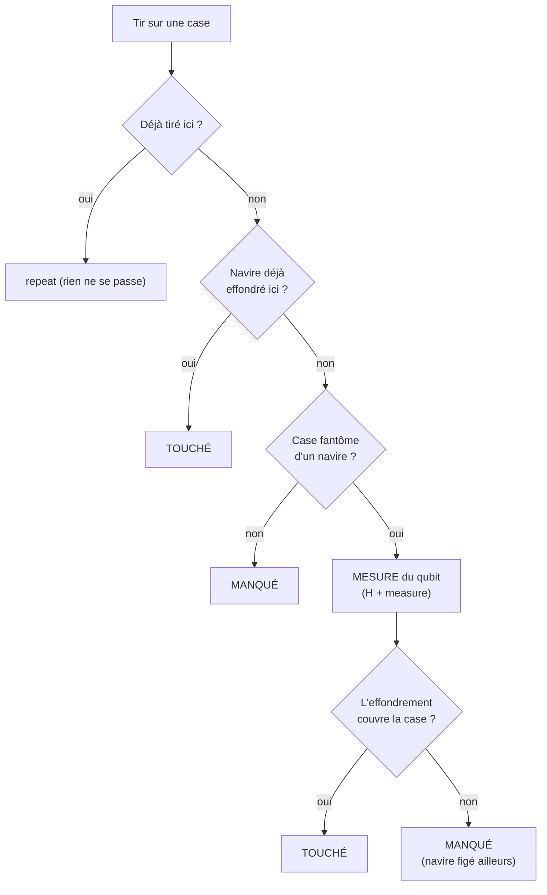
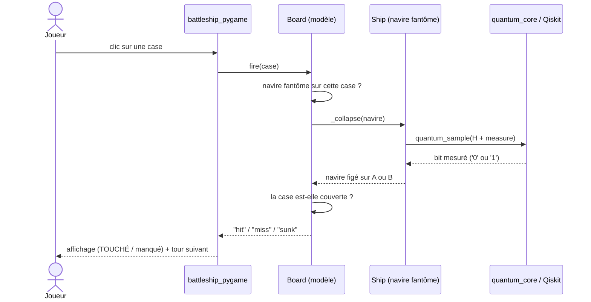
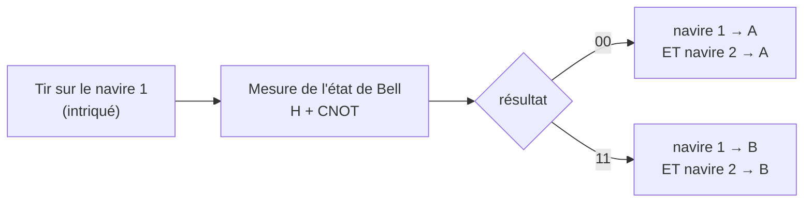
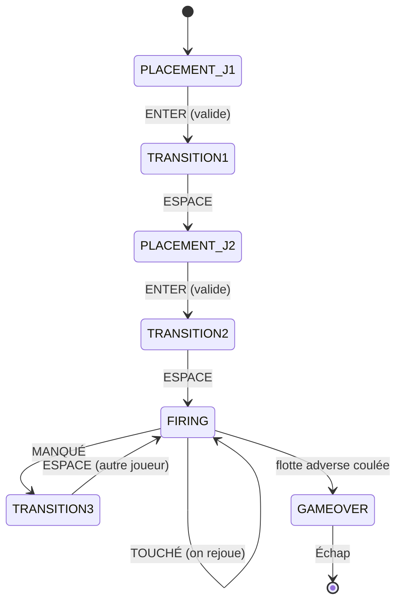
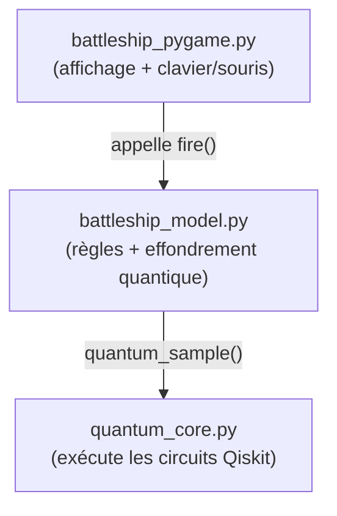

# Bataille navale quantique — Explication du fonctionnement

Ce document explique **comment le jeu marche**, du concept quantique jusqu'au code,
avec des schémas pour visualiser chaque mécanisme.


*Placement (navires en superposition, la paire intriquée a un bord blanc) → tir =
mesure → effondrement en touché/manqué.*

---

## 1. L'idée en une phrase

Dans une bataille navale **classique**, chaque navire occupe des cases fixes.
Ici, chaque navire est en **superposition sur deux positions possibles** (A ou B),
et **tirer dessus revient à le mesurer** : la mesure choisit au hasard une des deux
positions (c'est l'*effondrement* de la superposition).

---

## 2. Le concept quantique utilisé

On n'utilise qu'**un seul qubit par navire**. Un qubit peut être dans un mélange
(*superposition*) des états `|0⟩` et `|1⟩`. La porte **H** (Hadamard) crée le mélange
à 50/50 ; la **mesure** force le qubit à choisir `0` ou `1`.



Le circuit tient en deux instructions (`battleship_model.py`, méthode `_collapse`) :

```python
qc = QuantumCircuit(1, 1)
qc.h(0)          # superposition : 50% |0>, 50% |1>
qc.measure(0, 0) # le tir "observe" le navire -> effondrement
```

---

## 3. Table de correspondance quantique → jeu

C'est le cœur du projet : à chaque brique quantique correspond un élément de jeu.

| Élément quantique | Élément de jeu |
|---|---|
| 1 **qubit** par navire | l'incertitude sur la position du navire |
| état `\|0⟩` / `\|1⟩` | position candidate **A** / **B** |
| porte **H** (50/50) | navire « fantôme » présent aux deux endroits |
| **mesure** | un **tir** sur une case fantôme |
| **effondrement** (bit `0`/`1`) | la position réelle est fixée définitivement |
| porte **CNOT** (état de Bell) | deux navires **intriqués** : mesurer l'un fige l'autre (voir §5) |

---

## 4. Que se passe-t-il quand on tire ?

Un tir sur une case peut rencontrer trois situations. Seule la deuxième déclenche
une mesure quantique.



Ce parcours correspond directement à la méthode `Board.fire` dans
`battleship_model.py`. Un point important : **tirer sur un fantôme le fige**, même si
c'est un manqué — après ce tir, le navire n'est plus en superposition.

Vu **entre les fichiers**, un tir sur un navire fantôme déclenche cette séquence
d'appels (du clic jusqu'au simulateur Qiskit et retour) :



> **Règle de placement** : toutes les positions candidates (A et B de tous les navires
> d'un joueur) sont générées **sans aucune case commune**. Conséquence : peu importe
> comment les navires s'effondrent, deux navires ne peuvent jamais se retrouver sur la
> même case → aucun conflit à gérer.

---

## 5. L'intrication (navires liés — porte CNOT)

Dans chaque flotte, **deux navires** (les deux plus petits) sont **intriqués** : ils ne
sont pas mesurés indépendamment mais **ensemble**. On les prépare dans un **état de
Bell** avec une porte **H** suivie d'une porte **CNOT** (`cx`) :

```python
qc = QuantumCircuit(2, 2)
qc.h(0)
qc.cx(0, 1)               # intrication : état de Bell |00> + |11>
qc.measure([0, 1], [0, 1])
# résultat mesuré : toujours '00' ou '11' -> les deux qubits sont CORRÉLÉS
```

Conséquence dans le jeu : **le premier tir sur l'un des deux navires mesure la paire
entière**. Les deux navires s'effondrent au même instant et **du même côté** (tous deux
en A, ou tous deux en B) — c'est la corrélation parfaite de l'intrication. Le jeu
affiche alors « Intrication : le navire lié est aussi figé ! ».



> À l'écran, les navires intriqués sont repérables à leur **bord blanc** pendant le
> placement (voir le GIF en haut). Voir `Board._collapse` dans `battleship_model.py`.

---

## 6. Déroulement d'une partie (les écrans)

Le jeu est un **hotseat** : deux joueurs sur le même écran, à tour de rôle. Un écran
de **transition** (« Au tour du Joueur X ») s'intercale pour cacher la flotte d'un
joueur avant de passer la main.



Règles de tour :

- **Touché** → on garde la main et on rejoue immédiatement.
- **Manqué** → on passe la main (via l'écran de transition).
- **Toute la flotte adverse coulée** → victoire.

Commandes : **clic** = tirer · **R** = relancer le placement · **ENTER** = valider ·
**ESPACE** = passer la main · **Échap** = quitter (écran final).

---

## 7. Organisation du code

Trois fichiers, avec une séparation nette entre le quantique, la logique et l'affichage.



| Fichier | Rôle |
|---|---|
| `quantum_core.py` | Socle commun fourni par l'énoncé. Exécute un circuit et renvoie les résultats de mesure. Repli automatique sur un simulateur pur-Python si `qiskit-aer` est absent. |
| `battleship_model.py` | Toute la logique : navires, superposition A/B, `fire()` et l'effondrement via mesure. **Aucun affichage** → testable seul. |
| `battleship_pygame.py` | Uniquement l'interface : fenêtre, dessin de la grille, machine à états des écrans, gestion clavier/souris. |

---

## 8. Lancer le projet

Qiskit / Pygame n'ont pas de version compilée pour Python 3.14 → on utilise un
environnement Python 3.13 :

```powershell
py -3.13 -m venv .venv
.\.venv\Scripts\python -m pip install .

.\.venv\Scripts\python battleship_model.py    # vérifie la logique (asserts)
.\.venv\Scripts\python battleship_pygame.py   # lance le jeu
```

Pour régénérer le GIF de démo (nécessite Pillow) :

```powershell
.\.venv\Scripts\python -m pip install pillow
.\.venv\Scripts\python make_demo_gif.py       # (re)génère demo.gif
```

---

## 9. Pistes d'extension

- **Placement manuel** à la souris (actuellement aléatoire avec relance).
- Grille et flotte plus grandes (constantes `GRID` et `SHIP_SIZES`).
- Intriquer davantage de navires, ou en **anti-corrélation** (état `|01> + |10>`).
