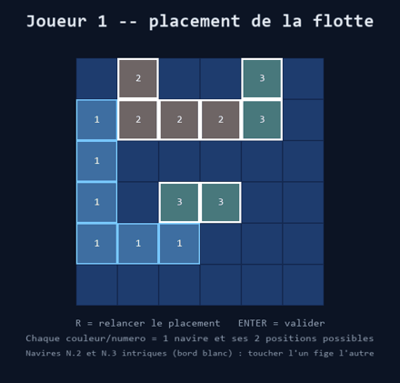

# Bataille navale quantique

Mini-projet d'initiation à l'informatique quantique — **sujet 2** (Qiskit + Pygame).

Chaque navire est placé en **superposition** sur deux positions candidates (A/B).
Tirer sur une case fantôme adverse déclenche une **mesure** Qiskit qui effondre le
navire : touché si l'empreinte retenue couvre la case, manqué sinon. Deux navires sont
en plus **intriqués** (état de Bell) : mesurer l'un fige l'autre. Interface Pygame,
**2 joueurs en hotseat**. Les 3 concepts du sujet — **superposition, mesure,
intrication** — sont donc mobilisés.



📖 Fonctionnement détaillé (avec schémas) : voir **[EXPLICATION.md](EXPLICATION.md)**.

## Table de correspondance quantique → jeu
| Élément quantique | Élément de jeu |
|---|---|
| 1 qubit par navire | l'incertitude de position du navire |
| `\|0⟩` = placement A, `\|1⟩` = placement B | les deux emplacements candidats |
| porte **H** (50/50) | navire fantôme en superposition |
| **mesure** | un **tir** sur une case fantôme = effondrement |
| bit mesuré `0`/`1` | position réelle retenue |
| porte **CNOT** (état de Bell) | deux navires **intriqués** : mesurer l'un fige l'autre |

## Fichiers
| Fichier | Rôle |
|---|---|
| `quantum_core.py` | Socle commun fourni par l'énoncé (exécute les circuits Qiskit) |
| `battleship_model.py` | Règles + effondrement quantique (logique pure, testable seule) |
| `battleship_pygame.py` | Interface graphique et boucle de jeu |

## Installation
Qiskit / Pygame n'ont pas de wheel pour Python 3.14 → on utilise un venv Python 3.13 :

```powershell
py -3.13 -m venv .venv
.\.venv\Scripts\python -m pip install .
```

## Lancer
```powershell
.\.venv\Scripts\python battleship_model.py    # auto-vérif de la logique (asserts)
.\.venv\Scripts\python battleship_pygame.py   # le jeu
```

## Comment jouer
1. **Placement** (chacun son tour) : une flotte est proposée au hasard. Chaque
   navire (couleur + numéro) apparaît à ses **deux positions possibles**.
   **R** pour relancer, **ENTER** pour valider, puis **ESPACE** pour passer la main.
2. **Tir** (chacun son tour) : **clic** sur une case adverse.
   - **Touché** → on rejoue immédiatement.
   - **Manqué** → on passe la main (**ESPACE** après l'écran de transition).
3. Premier joueur à couler toute la flotte adverse gagne.

Commandes : **clic** = tirer · **R** = relancer le placement · **ENTER** = valider ·
**ESPACE** = passer la main · **Échap** = quitter.
